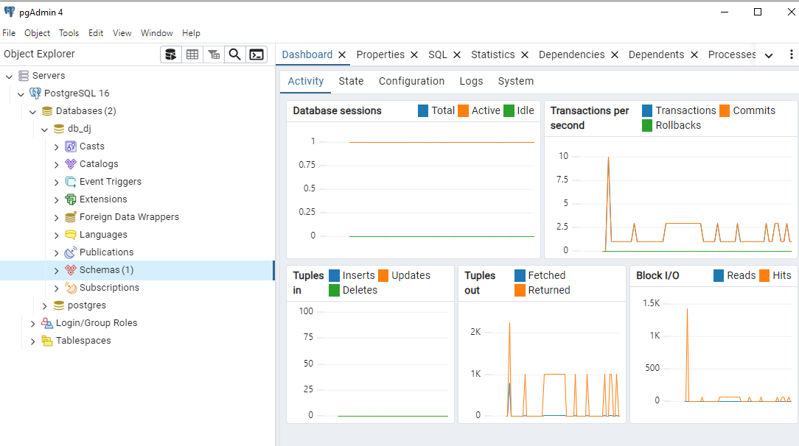
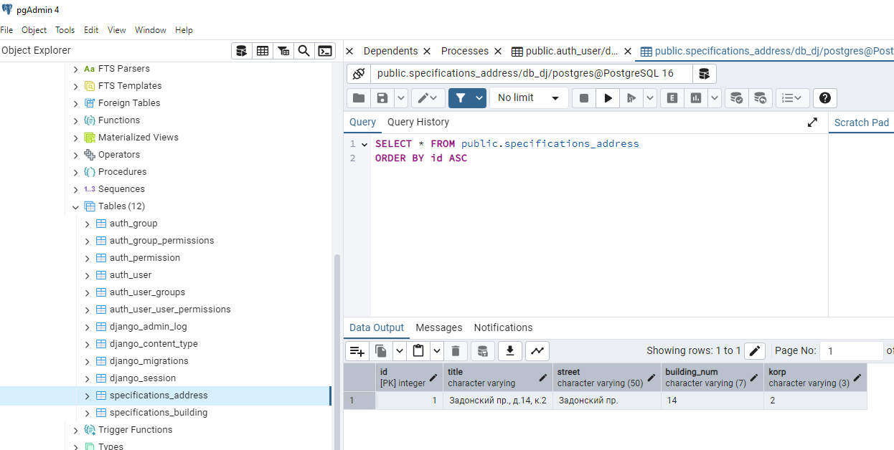
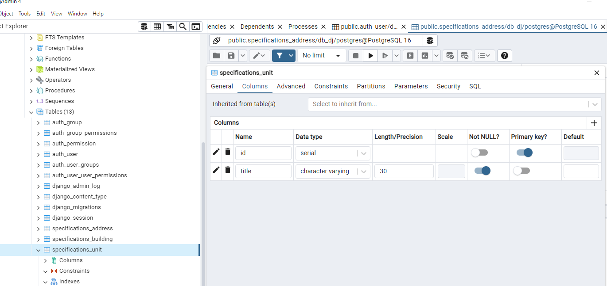

1) Старт работы с PostgreSQL. Скачайте и установите официальный пакет pgsql для
вашей ОС. Установите PGadmin и подключитесь к локальному серверу, создайте новую
базу данных и прикрепите скриншот выполненного задания.


3) В своем Django проекте установите драйвер psycopg2 для работы с базой PGSQL
используя менеджер пакетов pip. В файле настроек проекта выполните подключение к
базе данных:
````
DATABASES = {
'default': {
'ENGINE': 'django.db.backends.postgresql',
'NAME': 'имя_базы_данных',
'USER': 'имя_пользователя',
'PASSWORD': 'пароль',
'HOST': '127.0.0.1',
'PORT': '5432',
}
}
````
Создайте и выполните миграции используя makemigrations и migrate. Проверьте
подключение, в базе данных должны создаться технические таблицы Django проекта.


3) Перенесите любую созданную ранее модель базы данных в PGSQL. Используйте
Джанго модели и миграции. Создайте несколько таблиц через конструктор PGadmin и
свяжите их с Джанго проектом, создав необходимые модели.


4) Используйте Django ORM для тестирования запросов в вашу базу данных.
Выполните команду Python manage.py shell. Импортируйте необходимые модели из вашей
базы данных и создайте не менее 4 запросов, например:
Запрос на получение всех объектов базы данных и конкретного по id.
Запрос на фильтрацию
Запрос на добавление или удаление объекта
Запрос на подсчет количества объектов(len()), можно комбинировать с
фильтрацией.
````
>>> from specifications.models import Address, Buildings
>>> Building.objects.create(id = 2, title='Задонский пр., д.16, к.1',    
...                         address_id=2, number_of_floors = 12, number_of_entrances = 8,
...                         number_of_elevators=16, number_of_chutes=8, number_of_residents=1083,
...                         cleaning_area=1007, residential_area=12934.6)
<Building: Задонский пр., д.16, к.1>
>>> Building.objects.create(id = 3, title='Кустанайская ул., д.10, к.1',
...                         address_id=4, number_of_floors = 9, number_of_entrances = 8,
...                         number_of_elevators=8, number_of_chutes=8, number_of_residents=918,
...                         cleaning_area=1029.1, residential_area=13490.2)
<Building: Кустанайская ул., д.10, к.1>

**Показать все записи**:
>>> Building.objects.all()                                                 
<QuerySet [<Building: Задонский пр., д.16, к.1>, <Building: Задонский пр., д.14, к.2>, <Building: Кустанайская ул., д.10, к.1>]>

**Показать запись по id**
>>> Building.objects.filter(id=2)
<QuerySet [<Building: Задонский пр., д.16, к.1>]>

**Отфильтровать дома по улице:**
>>> Building.objects.filter(address__street='Задонский пр.').count() 
2
>>>
````
